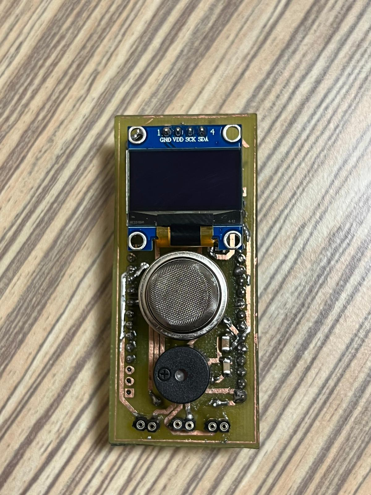
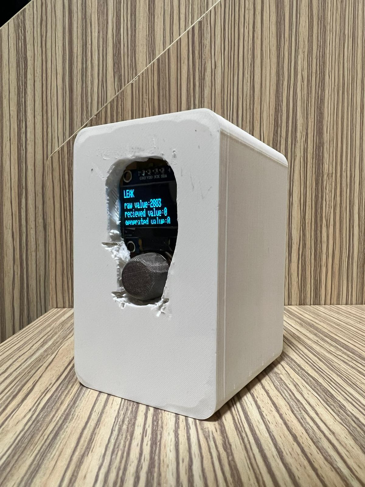

# ESPLeak

## Project Description

The master device in this project was developed to transmit the flammable gas density data, which it receives from the slave devices via the ESP-NOW protocol and measures with the sensor on itself, to the server via websocket.

## Hardware

- ESP32 Development Module
- MQ-9 Gas Sensor
- 64x128 OLED Display
- Buzzer
- 3.7V 18650 Li-ion Battery

   
  

## Dependencies

- Arduino.h
- Wire.h
- WiFi.h
- esp_now.h
- WebSocketsClient.h
- ArduinoJson.h
- Adafruit_GFX.h
- Adafruit_SSD1306.h

You can add these libraries through the Library Manager in the PlatformIO IDE.

## Quick Start

Download the project files to your computer and upload the project to your ESP32 board using PlatformIO IDE. Ensure that the required libraries are installed in the PlatformIO IDE.

## Configuration

Configure the necessary settings for the project in the [config.h](config.h) file. Settings include WiFi SSID, password, WebSocket server IP address, and port number.

## Contribution

If you wish to contribute to the project, please Fork the repository and create a Pull Request.

## Contact

For any questions or suggestions, please email [agoktugaydin@gmail.com](mailto:email@example.com).

